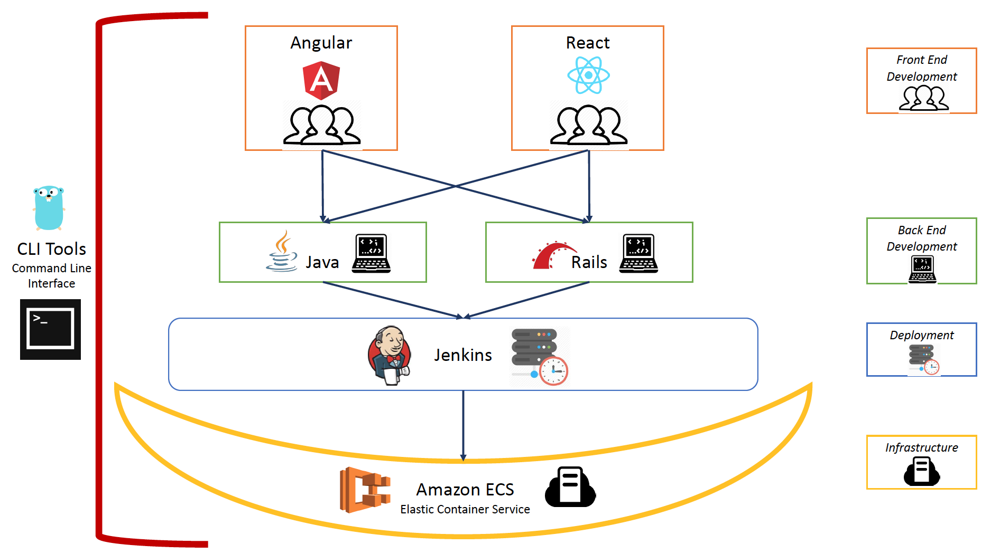

# TCP Angular
[](https://core-tcp-jenkins.excellalabs.com/job/CORE-TCP/job/tcp-angular/job/master/)
[](http://sonarqube.excellalabs.com:9000/dashboard?id=tcp-angular)
[](http://sonarqube.excellalabs.com:9000/dashboard?id=tcp-angular)
[](http://sonarqube.excellalabs.com:9000/dashboard?id=tcp-angular)
[](http://sonarqube.excellalabs.com:9000/dashboard?id=tcp-angular)
## Purpose

This is a front-end UI for a sample Tech-Challenge Platform:



## Prerequisites

- [Git](www.git-scm.com)
- [Node LTS](https://nodejs.org/) (which includes [Node Package Manager](https://www.npmjs.com/get-npm), `npm`, automatically)
- [Docker](https://www.docker.com/) (optional)

## Quick Start

1. Install the prerequisites, above
1. Clone this repo:   `git clone git@github.com:excellaco/tcp-angular.git`
1. Install dependencies:  `npm i`
1. Start up a back-end service
1. Start the Angular App via Docker or the Angular CLI (see the **Development** or **Production** sections below)
1. Navigate to http://localhost:4200 to open the app
1. Log in using the credentials specified in the chosen back-end service's README

## Deployment
Angular uses an environment file to manage deployment environment configurations.  They are found in `src/environments/`.

Updating the `domain` constant should be all that is needed.

```javascript
// Base domain for the API
const domain = 'localhost:8080'

export const environment = {
  // Whether or not this is a production environment
  production: true,
  // Base URL for all API calls
  api: `http://${domain}/api`,
  // List of domains that should utilize the user's JWT for API calls
  whitelistedDomains: [domain],
  // List of route(s) that should never use the user's JWT for API calls
  blacklistedRoutes: [`${domain}/api/oauth/`],
}
```

## Deployment to the ECS Cluster

To deploy to the ECS cluster, you need to set the domain to point to
the Java API, build the production Docker image, push it to the ECR,
and use ecs-cli to create and bring up the service.  Also open ports.

1. Installing and Configuring the aws and ecs-cli Command-Line Tools

    Follow the instructions from the tcp-ecs repo's README, in the
    section titled "Installing and Configuring the aws and ecs-cli Command-Line Tools".
    https://github.com/excellaco/tcp-ecs/

1. Setting the API domain:

    Find out what the external FQDN of the Application Load Balancer (ALB)
    is: this should be output when the tcp-ecs Terraform job runs.
    Change the domain line in `src/environments/environment.prod.ts`
    to use that instead of localhost; e.g.:
    `const domain = 'tcp-testing-3-dev-cluster-alb-877192071.us-east-1.elb.amazonaws.com:8080'`

    Note: do not include "http://"

    Note: do include the port, `:8080`

    Note: you *must* perform this step before doing the Docker image build.

1. Build the production Docker image:

    `npm run docker:build`

    Note: you may need to run this as root: `sudo npm run docker:build`
    This step will take about 4 minutes.  It uses the `prod.Dockerfile`.

    Do `docker image ls` to make sure the image was built: `excellaco/tcp-angular`

1. Push the image to the Elastic Container Repository (ECR):

    `ecs-cli push --aws-profile default excellaco/tcp-angular:latest`

    or, if necessary,

    `sudo ecs-cli push --aws-profile default excellaco/tcp-angular:latest`

1. Use ecs-cli to create a new task and bring up the service:

    Go to the tcp-angular-ecs subdirectory

    Note: all `ecs-cli compose` commands *must* be run from this subdirectory.

    `ecs-cli compose --aws-profile default service ps`

    Make sure the service is not running (either it doesn't show up, or it
    shows up with State = STOPPED). If it is running, do:

    `ecs-cli compose --aws-profile default service down`

    and wait for completion.

    Create the task and bring up the service on the ECS cluster:

    `ecs-cli compose --aws-profile default service up`

    This will take about 20 seconds.

    Double-check that the service is running:

    `ecs-cli compose --aws-profile default service ps`

    This will also tell you which host(s) it's running on.

1. Scale up the service (Optional)

    `ecs-cli compose --aws-profile default service scale 2`

1. Enable connections from the internet to the tcp-angular containers

    [In the future, we will replace this step with Terraform automation.]

    - a) Create a new target group; make its name end with "-to-3000-tg".
        Make sure to select the correct VPC.
        Set its type to Instance.  Set its protocol to HTTP. Set its target port to 3000.
        Do *not* register any instances with it directly: the Auto-Scaling Group (ASG) will do that for us.

    - b) Go to the cluster node ASG (name contains "-cluster-node") and attach the new target group:
        "Details" tab, "Edit" button.  Click in the "Target Groups" box, type "3000", select the new target group.
        Click "Save".

    - c) Remove any exsiting Listeners on the ALB that are listening on port 80.
        Add a Listener to the ALB: listen on 80, forward to the new target group.

    - d) Make sure the ALB's Security Group (name ends with "-alb-sg") allows connections on port 80.

    - e) Set the cluster node security group (name ends with "-cluster-instance-sg") to
        accept connections on 3000 from the ALB's Security Group.

## Development

There are two ways to run the app for local development:

1. Docker Compose
2. Angular CLI

#### Docker Compose

To run the app in a Docker container with live-reloading, run `docker-compose up` from the top-level directory. This will build the app image (using `local.Dockerfile`) and run it in a container (using `docker-compose.yml` as instructions). The app will be accessible via `localhost:4200`.

When finished developing, terminate the running container (`CTRL+C`) and run `docker-compose down` to safely bring down the container & its dependencies.

#### Angular CLI

To run the app using the Angular CLI approach, simply run `npm start`. The app can be accessed via `localhost:4200`.

## Production

There are three npm commands of importance:

- `npm run docker:build` builds the production Docker image (using `prod.Dockerfile`)
- `npm run docker:run` runs the built Docker image (can be accessed via `localhost:3000`)
- `npm run docker:debug` runs the built Docker image, automatically opens the URL, and adds additional logging

## Architecture

#### Application Architecture
The application architecture follows the standard [Angular folder structure](https://angular.io/guide/file-structure).

Here is an overview of the purpose / contents of the files/folders in this project

```bash
|-- e2e\ # End-to-End tests
|-- src\  # main source code folder
    |-- app\  # application code
        |-- abstracts\  # abstract form template
        |-- admin\  # admin feature module
            |-- manage-categories\
            |-- manage-skills\
            |-- admin-routing.module.ts
            |-- admin.module.ts
        |-- auth\  # authentication guards, interceptors, etc
        |-- employee\  # employee feature module
            |-- employee-form\  # manages the multi-stage form
                |-- bio-form\  # bio portion of employee form
                |-- contact-form\  #contact portion of employee form
                |-- review\  # review stage of employee form
                |-- skills-form\  # skills management portion of employee form
                |-- employee-form.component.html  # component template
                |-- employee-form.component.scss  # component styling (scoped to the component)
                |-- employee-form.component.spec.ts #component tests
                |-- employee-form.component.ts # component class, logic, configuration
            |-- employee-list\
            |-- self-service\  # User's "Manage My Skills" page
            |-- services\  # services used only within the Employee Module
                |-- primary-skill\  # Manages the Primary Skill "radio buttons"
                |-- state\  # US State CRUD service
            |-- employee-routing.module.ts  # Employee module child routes
            |-- employee.module.ts  # Employee module configuration
        |-- error\  # error view (404, etc)
        |-- home\  # user home page
        |-- login\  # login page
        |-- main-nav\  # sidebar navigation
        |-- messaging\  # toast and modal views and services
        |-- models\  # data models and interfaces
        |-- pipes\  # in-template formatters
        |-- services\  # CRUD and other API services
            |-- abstract\
            |-- auth\
            |-- employees\
            |-- skill-categories\
            |-- skills
        |-- utils\  # helper functions, custom form validators
    |-- assets\  # images, theme color variables, etc
    |-- environments\  #environment configuration files
    |-- index.html  #don't ever modify this
    |-- main.ts
    |-- styles.css  # globally applied styles
    |-- theme.css  # Material theme configuration
|-- angular.json  # angular configuration
|-- docker-compose.yml
|-- Jenkinsfile
|-- package-lock.json # managed by NPM, don't change manually
|-- package.json # dependency management, linter tool config
|-- README.md

```

## Auth

#### Login

The login page allows the user to provide a username and password. The application then sends down that information in an HTTP request. If the API returns a successful response, it will come in the form of a Java Web Token (JWT). The JWT will then be stored locally (currently in localStorage) using a lookup key (the key name is stored in the AuthService)

#### Java Web Token

A [Java Web Token](https://jwt.io/) is an json object that has been encoded as a string. The JWT for our application takes the following form:

```
{
  authorities: string[]
  client_id: string
  exp: number
  jti: string
  scope: string[]
  user_name: string
}
```

- `authorities` lists the roles or permissions the user has in the Angular app
- `client_id` specifies which app is authenticating the user
- `exp` is the expiration date/time of the JWT
- `jti` case sensitive unique identifier of the token, even among different issuers (useful for the API)
- `scope` lists the roles/permissions the JWT supports with regards to the API (read, write, etc)
- `user_name` stores the username of the user that the JWT belongs to

#### AuthGuard

An [AuthGuard](https://angular.io/guide/router#milestone-5-route-guards) is used to prevent users from navigating to screens that they are not allowed to see. This guard will check to see if the user is logged in, and if not it will always redirect them to the login page. Additionally, the authGuard can be given a roles property which will in turn check the role from the JWT object and only allow users to proceed if they are one of the accepted roles. Otherwise it will redirect them to the home page.

## Forms

[Angular Reactive Forms](https://angular.io/guide/reactive-forms) provide a fantastic platform for responding to user input asynchronously.  However, the system does not have great support for parent/child relationships within forms or forms split across multiple components.  This make large or multi-stage forms cumbersome.

This app has a buit-in pattern to overcome this issue.  Form Components extend the `BaseForm` class, which provides a basic pattern for sharing references between sibling components, or for child forms to broadcast their form references to parents:

- `formGroup` is a ref to the core, top-level `FormGroup` in the component.
- `formReady` is an `Output` property that emits the `formGroup` (or some other `AbstractControl`) to be caught by the parent component.
- `destroyForm` is an `Output` property that should emit when the component is destroyed (must be called by the implementor in `ngOnDestroy()`).

Several helper functions exist to help parents catch and dispose of any child `FormGroup` as those components are spawned/despawned:

- `registerForm()` is the default function for catching a child's `FormGroup` when it is emitted, and supports attaching that `FormGroup` reference to the receiver's `FormGroup` instance
- `deregisterForm()` clears the reference when a child component is destroyed (the child should emit on `destroyForm` in `ngOnDestroy`)

Lastly, an abstract method must be implemented by any implementing class:

- `buildForm` is responsible for building the baseline, empty `FormGroup` that will be used by the form.

#### BaseForm implementation notes

- `formGroup` should be created/assigned (by calling `buildForm`) in the constructor so the form controls are available when Angular binds the template to the class (which happens before `OnInit`)
- If the form should support editing, respond to a change in an `@Input` property in `ngOnChanges` using the `hasChanged()` helper function, and use `patchValue` to update the form with the new value
- Use [Angular Material Form Components](https://material.angular.io/components/categories/forms) whenever possible
- Utilize the `RequiredMessagePipe` for required messages when form fields are required. This supports a universal required message that's easy to update everywhere at once.

## CRUD Services

Most CRUD operations are identical, except for the API endpoint and format of the data being managed. Leveraging this fact, there is a `BaseCrudService` that can be utilized to quickly build an [Angular Service](https://angular.io/tutorial/toh-pt4) that supports CRUD to a given endpoint that serves data aligned with a given object or interface.

This effectively reduces basic CRUD services to a handful of lines of code, once an API contract has been established using [typescript interfaces](https://www.typescriptlang.org/docs/handbook/interfaces.html) or javascript classes.

*skills.service.ts*
```typescript
@Injectable()
export class SkillsService extends BaseCrudService<ISkill>
  implements IBaseCrudService<ISkill> {
  endpoint = '/skill/'

  constructor(protected http: HttpClient) {
    super(http)
  }
}
```

## Routing

Base routing is handled through the `app-routing.module.ts` file.

Sub-routes such as the employee module will have their own `routing.module.ts` file for further routing within that sub-module.

The `admin` module and `employees` module are both [lazy loaded](https://angular.io/guide/lazy-loading-ngmodules), which means they are not downloaded to the user's browser until they are requested.  

This has several advantages:
- drastically reduces the initial payload to the user, resulting in a very fast initial rendering of the application.
- increases security since unauthenticated users only receive the public portion of the site in their download, so users must successfully authenticate before they even get to download the rest of the application
- Angular is better able to tree-shake the application and optimize the lazy-loaded modules since those don't need whatever is already included in their parent modules
- Lazy Loaded modules can also be pre-fetched.  This enables a scenario where the login page paints quickly and the standard user module is downloaded while the user goes through authentication.

The module routing files are where the AuthGuards, Interceptors and other routing functions are wired into the application.

#### Route Resolvers

In many cases, it is desirable for lists of data to be ready before the comonents are rendered for the first time; whether these lists are the contents of a select input, a data table or reference for some business operation.

Any service that extends the `BaseCrudService` can also be wired into a route as its own route resolver.

*From app-routing.module.ts:*
```typescript
const routes = [
  ...
  {
    // url segment:  http://myapp.com/admin
    path: 'admin',

    // lazy-loaded module
    loadChildren: () => import('./admin/admin.module').then(mod => mod.AdminModule),  

    // Authentication Guard wired in
    canActivate: [AuthGuard],
    data: { roles: [Role.admin] },  // data fed into Auth Guard

    // Resolve these before trying to render the route
    resolve: { skills: SkillsService, categories: SkillCategoriesService },  
  },
  ...
]
```

## Style

[Angular Material](https://material.angular.io/) (@angular/material) is the component and style library used.

This brings in Google's [Material Design](https://material.io/design/) styling, plentiful web accessability features and built-in animations. A color theme already compliant with [USWDS](https://designsystem.digital.gov/) is defined in `theme.scss`.

To add more [Angular Material](https://material.angular.io/components/categories) components to the application, import them in the `material.module.ts` file. Material components come with built in 508 compliance, so long as `aria` inputs are provided when they are used.

## Layout

[Angular Flex Layout](https://github.com/angular/flex-layout/wiki) (@angular/flex-layout) is the library used for positioning components in the application.

#### Narrative

This was chosen because the Flex Layout library has media-queries built in and thus provides a quick way to dictate different layouts based on user screen size.  This means we can easily make the entire ap reactive and mobile friendly by simply specifying different layouts based on screen size.

The library does not try to implement it's own flex manager, instead it simply renders the in-template configurations into native css flex settings.  This very neatly reduces the css boilerplate required to implement flex in an angular-friendly way by using angular directives.


#### Examples

`<div fxFlex="50%">` - sets a div with a width of 50% the current screen width

`<div fxLayout="row" fxLayout.xs="column">` - sets the container div to use a row layout for it's children normally, but use a column layout when the screen size is extra small (xs), like on mobile devices.  This is very useful for reorganizing forms, where the fields should be side-by-side for desktop users, but likely need to be arranged vertically for mobile users.

The author of the library has an amazingly useful demo site, here:  https://tburleson-layouts-demos.firebaseapp.com/#/docs

## Messaging

The application makes use of Angular Material's [SnackBar](https://material.angular.io/components/snack-bar/overview) for simple operation confirmation messages, and [MatDialog](https://material.angular.io/components/dialog/overview) for larger, more important (and interactable) confirmation dialogs.

#### SnackBar (toasts)

1. Dependency inject the service into the component/service that will source the toast
1.  Use `openSnackBar()` to send a toast to the user
```typescript
constructor(private snackBarService: SnackBarService) {
  this.snackBarService.openSnackBar('This is the toast message')
}
```
If using the snackbar to notify success/failure on a CRUD operation, use the `observerFor<T>()` function to build an [observer](http://reactivex.io/rxjs/class/es6/MiscJSDoc.js~ObserverDoc.html) for the call.  The function automatically handles success/failure messaging using the prefix string provided.
```typescript
onDeleteSkill(id: number) {
    this.skillService
      .delete(id)
      .subscribe(this.snackBarService.observerFor<ISkill>('Delete Skill'))
  }
```

This can be overloaded with additional functions if additional work needs to be done on success/fail/close of the subscription.
```typescript
observerFor<T>(
    action: string,
    next?: (value: T) => void,
    error?: (err: any) => void,
    complete?: () => void
  ): Observer<T>
```

#### Modal Dialogs

Similar to the SnackBar, the [Angular Material Dialog](https://material.angular.io/components/dialog/overview) system uses services to trigger and handle responses to modals.

*Example use of a simple dialog from the manage-skills.component.ts file:*
```typescript
onDeleteCategory(id: number) {
  ...
  if (hasSkills) {
    this.dialogService.confirm({
      title: 'Confirm Deletion',
      message: 'Deleting a Category with Skills will also delete those Skills.',
      accept: () => {
        this.deleteHelper(id) // actually perform the delete
      },
      cancel: () => null,
    })
  }
}
```

The TCP-Angular dialog service uses a custom component to render the modal content. This can easily be modified or copied to create modals that display whatever data may be needed however the client may wish.


## Testing

85% is the agreed upon TCP minimal test coverage amount

Some useful testing commands:
- `npm run test` To run the automated unit/integration tests.  A browser window will pop up and the tests will be displayed as they run.
- `npm run test:headless` To run the tests without the pop-up and have a nice result summary in the console.  This is a useful setup for devs writing tests
- `npm run test:coverage` To run code-coverage.  Coverage details can be found by opening `coverage/tcp-angular/index.html` in a browser.
- `npm run e2e` To run the End-to-End (E2E) tests.  NOTE: The complete application must already be up and running for these tests to work.
